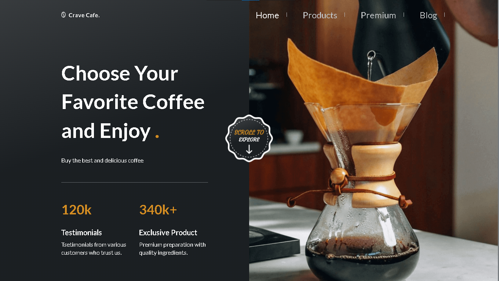
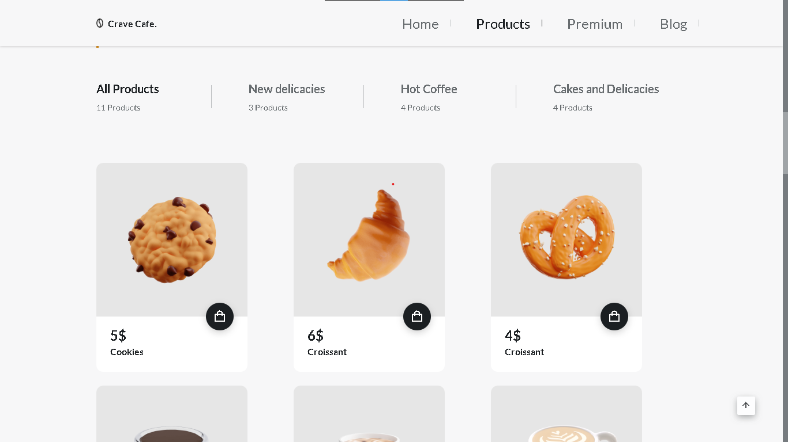
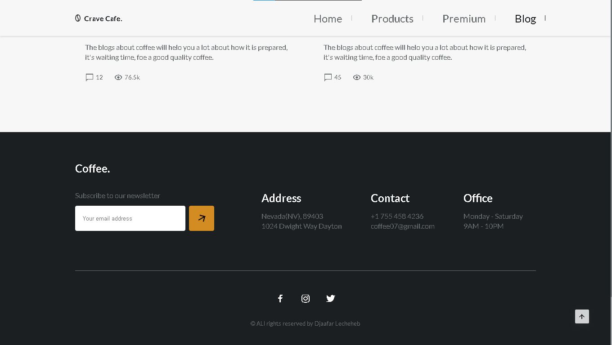

# Coffee & Snacks Shop



Welcome to **Coffee & Snacks Shop**, your go-to platform for purchasing freshly brewed coffee and delicious snacks online. Our website is designed to provide a seamless and enjoyable shopping experience for coffee and snack lovers.

---

## Features

- **User-Friendly Interface**: A simple and intuitive design to make browsing and purchasing easy.
- **Wide Variety of Products**: Freshly brewed coffee, teas, pastries, and other snacks.
- **Responsive Design**: Optimized for desktop and mobile devices.

---

## Installation

1. Download or clone the repository:
   ```bash
   git clone https://github.com/your-username/coffee-shop.git
   ```
2. Navigate to the project directory:
   ```bash
   cd coffee-shop
   ```
3. Open the `index.html` file in your preferred browser.

---

## Screenshots

### Home Page


### Products Page


### Contact Page


---

## Demo Video

Watch the full walkthrough of the website:

[](https://www.youtube.com/watch?v=YOUR_VIDEO_ID)

---

## Technologies Used

- **Frontend**: HTML, CSS, JavaScript

---

## How to Contribute

We welcome contributions! Here’s how you can help:

1. Fork the repository.
2. Create a new branch:
   ```bash
   git checkout -b feature-name
   ```
3. Commit your changes:
   ```bash
   git commit -m 'Add some feature'
   ```
4. Push to the branch:
   ```bash
   git push origin feature-name
   ```
5. Open a pull request.

---

## License

This project is licensed under the MIT License. See the LICENSE file for details.

---

## Contact

For any inquiries, feel free to reach out:

- **Youtube**: [CodeCraftDL](youtube.com/@codecraftdl)
- **Instgram**:[CodeCraftDL](instgram.com/ddos_attac_co)

---

Thank you for visiting **Coffee & Snacks Shop**! Enjoy shopping with us.
